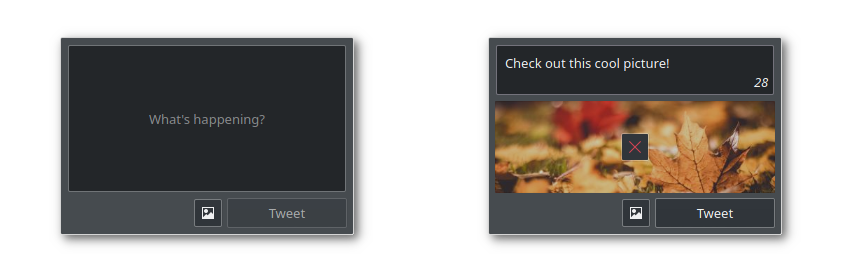

# Plastweet
_A small plasmoid to tweet directly from your Plasma desktop (WiP)_

The primary goal of this project is to bring the ability to quickly send tweets without opening your browser or any other program. It aims to be as simple and lightweight as possible.

## Features
Currently, posting tweet updates is the only available function. Although UI for adding images and videos is already there, it doesn't actually work with the JavaScript implementation (I'm working on it!).
However, you still can get this feature if you clone and compile the previous version (check the `cxx-backend` branch), but keep in mind that it requires additional dependencies and to be compiled.

## Planned Features
- [ ] Attach images or video
- [ ] OAuth authentication
- [ ] Receive notifications on account interactions
- [ ] Integration with "Online Accounts"
- [ ] Dialog to search and add GIF images
- [ ] Automatic threads
- [ ] Drafts
- [ ] Username auto-completion
- [ ] Hashtag highlighting

## TODO
- [ ] Handle errors
- [ ] Add a progress bar
- [ ] Native notifications support
- [ ] Re-implement media upload
- [ ] Safely store login details
- [ ] Spell checking support

## Credits
* [twitter-lite](https://github.com/draftbit/twitter-lite) (MIT)
* [cross-fetch](https://github.com/lquixada/cross-fetch) (MIT, _twitter-lite dependency_)
* [crypto-js](https://github.com/brix/crypto-js) (MIT, _twitter-lite dependency_)
* [oauth-1.0a](https://github.com/ddo/oauth-1.0a) (MIT, _twitter-lite dependency_)
* [querystring](https://github.com/Gozala/querystring) (MIT, _twitter-lite dependency_)

