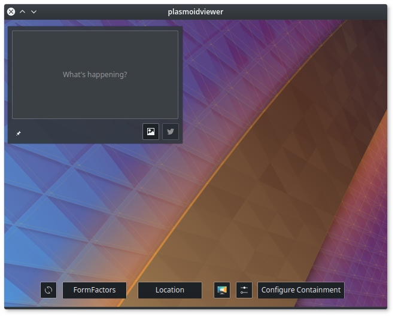
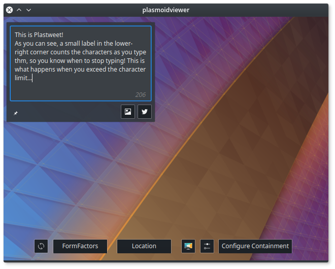
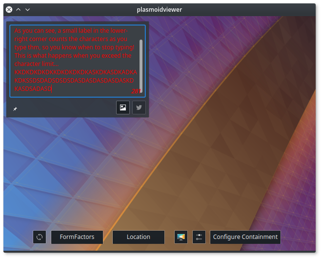
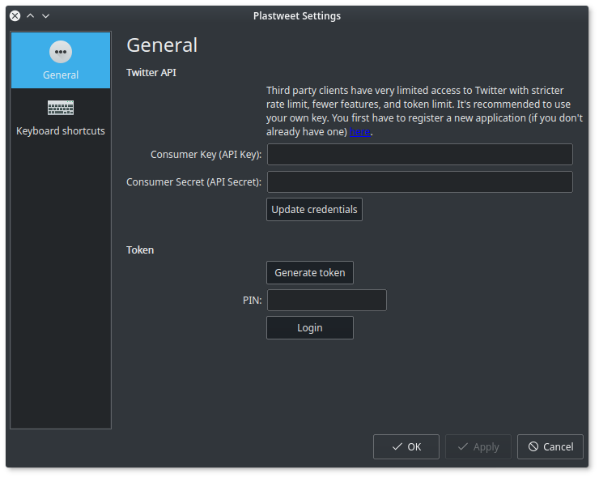

# Plastweet
## A small plasmoid to post tweets directly from your Plasma desktop (WiP)
The primary goal of this project is to bring the ability to quickly send tweets without opening your browser or any other program. It has to be as simple and lightweight as possible.

### Tentative Design





### Requirements
* [Twitcurl](https://github.com/swatkat/twitcurl)
* liboauth
* libcurl
* Extra CMake Modules
* KF5 & Plasma, obviously

### Test (currently useless)
```Bash
git clone https://github.com/gustawho/plastweet.git
cd plastweet && mkdir build && cd build
cmake -DCMAKE_INSTALL_PREFIX=/usr/local -DKDE_INSTALL_USE_QT_SYS_PATHS=ON ..
make
sudo make install
cd ..
kpackagetool5 -t Plasma/Applet --upgrade package && plasmoidviewer --applet package
```

### Planned Features
* Add pictures or video
* Change the API settings if needed
* Receive notifications on account interactions (mentions, for instance... Optional and still in discussion)
* Integration with "Only Accounts"
* Dialog to search and add GIFs

### TODO:
* Convert text input to std::string (Twitcurl takes std::string, but QML only returns QString and similar)
* Fix the connection between QML and C++
* Add a progress bar
* Native notifications support
* Implement media upload
* Safely store login details
* Spell checking support
