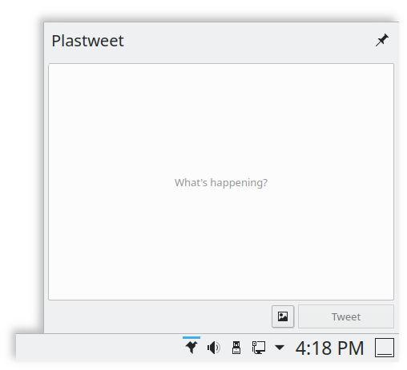

# Plastweet
A small plasmoid to post tweets directly from your Plasma desktop (WiP)

<a href="https://www.kdevelop.org/" target="_blank"></a>
<a href="https://store.kde.org/p/1407433/" target="_blank"></a>

The primary goal of this project is to bring the ability to quickly send tweets without opening your browser or any other program. It has to be as simple and lightweight as possible.




## Dependencies
* cURL
* [JsonCpp](https://github.com/open-source-parsers/jsoncpp)
* Qt5 GraphicalEffects (runtime dependency)
* KF5 & Plasma

## Installation
Currently, posting tweets (both text only and with one image attached) is the only available feature and as OAuth login isn't implemented yet, you need to register an application in [developer.twitter.com](https://developer.twitter.com/apps) and configure the plasmoid accordingly.

### Package dependencies

* Kubuntu, KDE Neon:
```
sudo apt install build-essential cmake extra-cmake-modules plasma-workspace-dev qtquickcontrols2-5-dev \
  kirigami2-dev gettext libkf5notifyconfig-dev libkf5notifications-dev libcurl4-gnutls-dev libjsoncpp-dev qtwebengine5-dev
```
> Note: JsonCpp headers might be located in a different path than the one referenced in Plastweet's code. If build fails, please open `src/plugin/backend.cpp` and fix the `#include` lines, then try again.

* Arch Linux, Manjaro, KaOS:
```
sudo pacman -S base-devel git extra-cmake-modules jsoncpp qt5-graphicaleffects knotifications
```

* openSUSE:
```
sudo zypper in git extra-cmake-modules jsoncpp-devel libcurl-devel \
  plasma5-workspace-devel plasma-framekwork-devel knotifications-devel \
  libQt5Core-devel libQt5QuickControls2-devel
```

### Build
```bash
git clone https://github.com/gustawho/plasma5-applets-plastweet.git
cmake -B build -S . -DCMAKE_INSTALL_PREFIX=/usr -DCMAKE_BUILD_TYPE=Debug -S plasma5-applets-plastweet
cmake --build build --config Debug
sudo cmake --install build --config Debug
```

## Planned Features
- [ ] OAuth authentication
- [ ] Receive notifications on account interactions
- [ ] "Online Accounts" integration
- [ ] Dialog to search and add GIFs
- [ ] Automatic threads
- [ ] Drafts
- [ ] Username autocomplete/suggestions
- [ ] Highlight hashtags
- [ ] Spell checking support
- [ ] Reply to responses from notifications

## TODO:
- [ ] Gracefully handle errors
- [ ] Add a visual aid to show media upload progress
- [ ] Tweet multiple pictures
- [ ] Safely store credentials
